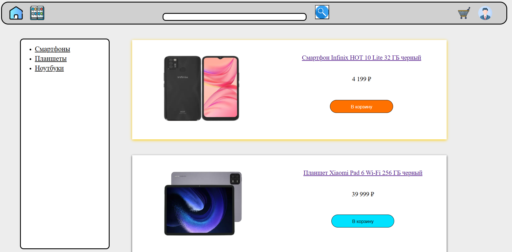

# Введение
TecnoPy - это небольшой интернет магазин, написанный на Flask. В нем были реализованы: каталог, карточки, панель администратора, а также поисковая система.

# Скрины
```
/catalog
```


```
/product-name
```


```
/login_admin
```


```
/admin
```


```
/add_card
```
